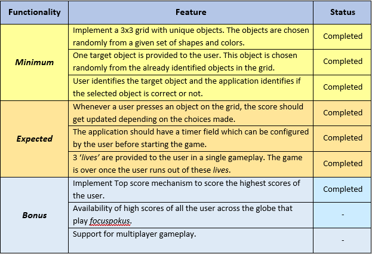
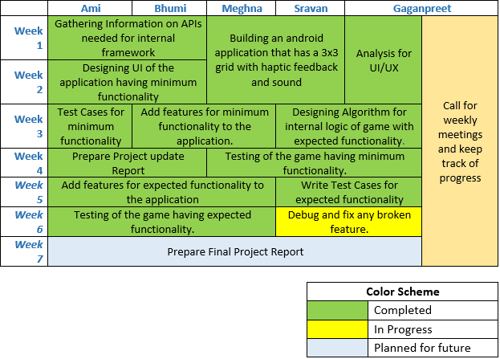
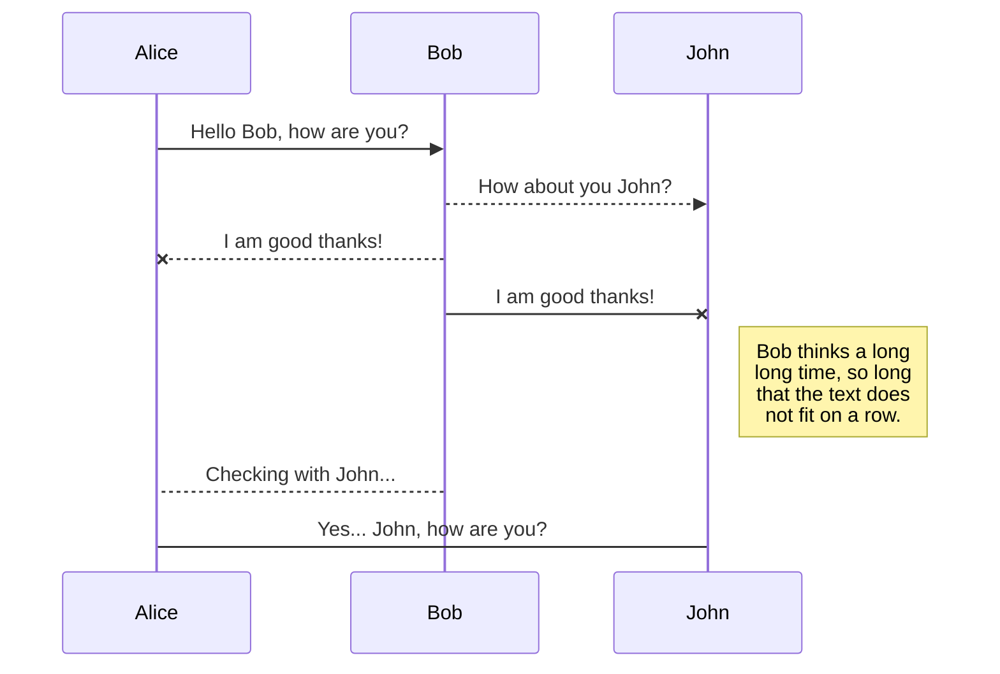
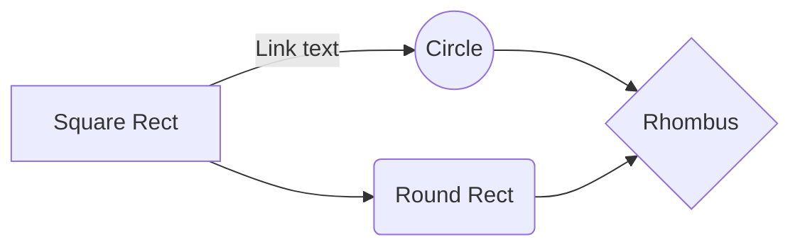

 

# &nbsp;&nbsp;&nbsp;**FocusPokus**
  
  
## Team FocusPokus
|Name|BannerID |
|--|--|
| *Ami Trivedi* | B00828817 |
| *Bhumi Patel* | B00824756 |
| *Sravan Sajeev* | B00825856 |
| *Meghna Ramachandra Holla* | B00812604  |
| *Gaganpreet Singh* | B00819217|
 

## GitLab
[Click here](https://git.cs.dal.ca/singh1/focuspokus.git) to go to GitLab Repository. 
***Note:*** Drop a mail to [Gaganpreet Singh](gaganpreet.singh@dal.ca) to gain access to git Repository.  

## Project Summary
**FocusPokus**, the Android application developed as a part of the Mobile Computing project-work, is a minimalistic yet captivating game that aims at inculcating cognitive skills.

FocusPokus appeals to those who enjoy games that are engaging and captivating. The game has objects with complex shapes and colors that vary with time. FocusPokus requires simple actions that enable even a naïve user to play easily.

An important characteristic of this game is that it can be played even without an active internet connection, thus making it a standalone application. This game is intended for age 5 and up. The features of this application are:
+ Home page with an attractive and minimalistic design 
+ Using SharedPreferences for storing user choice throughout the application lifecycle  
+ Interesting music choice for engrossing player attention
+ No account creation for the purpose of playing the game (no Internet connection needed)
+ Meaningful onboarding information for the first-time users
+ Keep track of past scores
  

## Libraries
The following libraries were used while developing focusPokus: 

1. **java.util.Random**  
Used to generate random numbers. Source [here](https://developer.android.com/reference/java/util/Random)
 
2. **android.media.MediaPlayer**  
Used to control variety of media types and to integrate audio, video and images into application. Source [here](https://developer.android.com/guide/topics/media/mediaplayer)
 
3. **android.view.HapticFeedbackConstants**  
Used to perform haptic feedback effects on click event. Source [here](https://developer.android.com/reference/android/view/HapticFeedbackConstants)
 
4. **android.database.sqlite.SQLiteDatabase**  
Provides methods to create, delete, update SQL commands, and other common database management tasks. Source [here](https://developer.android.com/reference/android/database/sqlite/SQLiteDatabase)

5. **android.content.SharedPreferences**  
Used to store small collection of data in key-value pairs locally and read/write this data. Source [here](https://developer.android.com/training/data-storage/shared-preferences)

6. **android.os.Vibrator**  
Controls vibration  effect on the device. On exiting the application, vibration effect stops. Source [here](https://developer.android.com/reference/android/os/Vibrator)

7. **android.os.CountDownTimer**  
Used to set count-down time for the game. On completion of defined time, timer stops running. Source [here](https://developer.android.com/reference/android/os/CountDownTimer)
  

## Functionality
There has been no change in the functionality from the estimated proposal. All the features of minimum and expected functionality have been implemented successfully. Moreover, we were able to achieve one of the bonus features i.e., implementation of the top scores.
  
We are currently working on improving the User interface and User experience of the application. 

## Individulal Contributions
The following table depicts the task distribution and current progress of the project.    

## Problem and Solutions
1. **GridView vs AndroidCanvas**
Refreshing and updating the grid was a challenging task. AndroidCanvas was initially used to render objects on the screen, but this did not refresh the grid as per our requirement. Therefore, GridView was used. This refreshes the screen and displays the new grid without any delay.

2. **Object Creation on Grid**
Initially, simple shapes from Android library were used like Square, Circle, Pentagon, and so on. We identified a method to combine custom images(png format) with custom colors. Firstly, we implemented dynamic loading of png images from drawable resource. Secondly, we combined the custom colors with these images using ResourcesCompat function.

3. **Toggle Option in Settings Menu**
The task of retrieving values of toggle buttons into the main java file from multiple XML files was a challenge. The option chosen by the user was not saved in our application. Therefore, we used SharedPreferences interface. The options selected by the user are saved in key-value pairs and stored locally. This enables us to view and access the toggle selections made across all java classes.

## UML diagrams

You can render UML diagrams using [Mermaid](https://mermaidjs.github.io/). For example, this will produce a sequence diagram:

And this will produce a flow chart:

