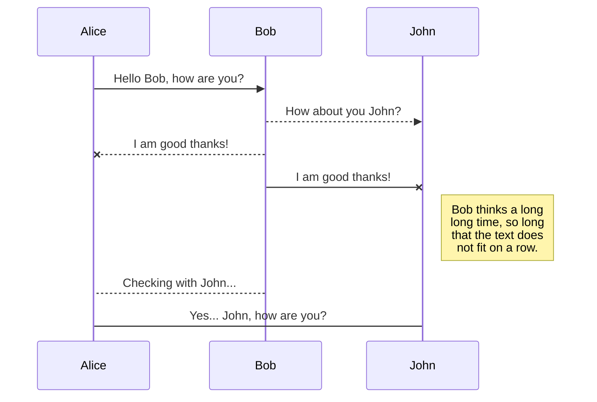
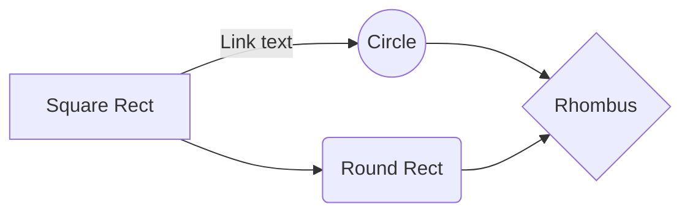

 

# &nbsp;&nbsp;&nbsp;**FocusPokus**
  
  
## Contributors
|Name|BannerID |
|--|--|
| *Ami Trivedi* | B00828817 |
| *Bhumi Patel* | B00824756 |
| *Sravan Sajeev* | B00825856 |
| *Meghna Ramachandra Holla* | B00812604  |
| *Gaganpreet Singh* | B00819217|
 

## GitLab
[Click here](https://git.cs.dal.ca/singh1/focuspokus.git) to go to GitLab Repository. 
***Note:*** Drop a mail to [Gaganpreet Singh](gaganpreet.singh@dal.ca) to gain access to git Repository.  

## Project Summary
**FocusPokus**, the Android application developed as a part of the Mobile Computing project-work, is a minimalistic yet captivating game that aims at inculcating cognitive skills.

FocusPokus appeals to those who enjoy games that are engaging and captivating. The game has objects with complex shapes and colors that vary with time. FocusPokus requires simple actions that enable even a naïve user to play easily.

An important characteristic of this game is that it can be played even without an active internet connection, thus making it a standalone application. This game is intended for age 5 and up. The features of this application are:
+ Home page with an attractive and minimalistic design 
+ Using SharedPreferences for storing user choice throughout the application lifecycle  
+ Interesting music choice for engrossing player attention
+ No account creation for the purpose of playing the game (no Internet connection needed)
+ Meaningful onboarding information for the first-time users
+ Keep track of past scores
  

## Libraries
The following libraries were used while developing focusPokus: 
1. **java.util.Random**  
This class instance can be used to generate random numbers. Source [here](https://developer.android.com/reference/java/util/Random)
 
1. **android.media.MediaPlayer**  
MediaPlayer class can be used to control variety of media types and to integrate audio, video and images in to application. Source [here](https://developer.android.com/guide/topics/media/mediaplayer)
 
1. **android.view.HapticFeedbackConstants**  
This constant can be used to perform haptic feedback effects on click event. Source [here](https://developer.android.com/reference/android/view/HapticFeedbackConstants)
 
1. **android.database.sqlite.SQLiteDatabase**  
SQLiteDatabase provide methods to create, delete and update SQL commands for  application. It also  perform other common database management tasks. Source [here](https://developer.android.com/reference/android/database/sqlite/SQLiteDatabase)

1. **android.content.SharedPreferences**  
SharedPreference can be used to save small collection of key-value in application as local data. A SharedPreferences object also provides simple methods to read and write key-value data. Source [here](https://developer.android.com/training/data-storage/shared-preferences)

1. **android.os.Vibrator**  
This class control vibrate  effect on the device. If application process exits, vibration effect will stop. Source [here](https://developer.android.com/reference/android/os/Vibrator)

1. **android.os.CountDownTimer**  
This class is used to set count down time in application and it will stop after completion of defined time. Source [here](https://developer.android.com/reference/android/os/CountDownTimer)
  

## Functionality
There has been no change in the functionality from the estimated proposal. All the features of minimum and expected functionality have been implemented successfully. Moreover, we were able to achieve one of the bonus features i.e., implementation of the top scores.
 
We are currently working on improving the User interface and User experience of the application.  

## Individulal Contributions
The following table depicts the task distribution and current progress of the project.  

## UML diagrams

You can render UML diagrams using [Mermaid](https://mermaidjs.github.io/). For example, this will produce a sequence diagram:

And this will produce a flow chart:

